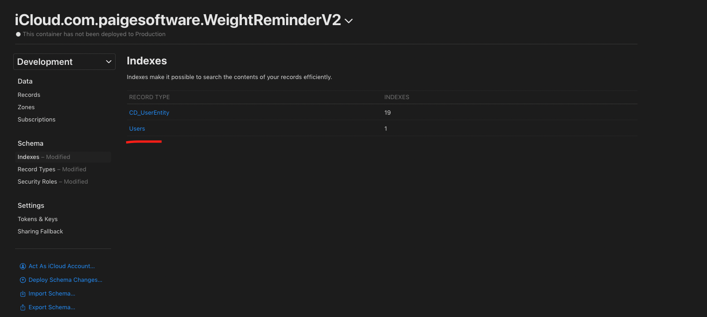
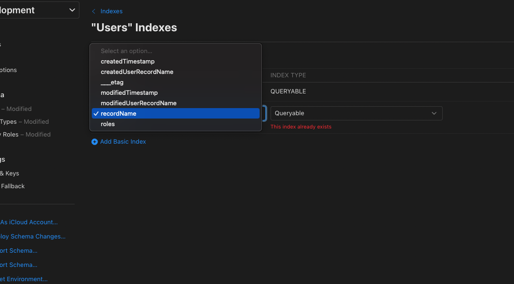
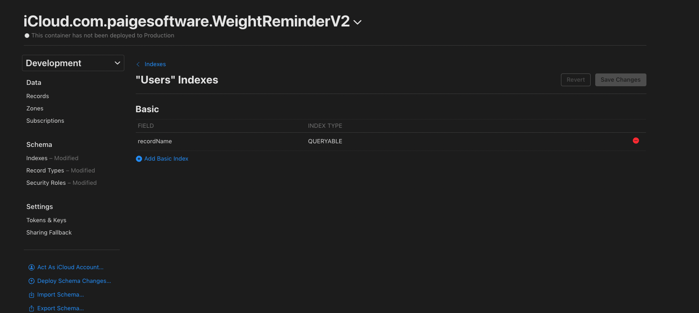

#  CloudKit UserInfo

```swift
import SwiftUI
import CloudKit

class CloudKitUserBootcampViewModel: ObservableObject {
    
    @Published var isSingedInToICloud: Bool = false
    @Published var error: String = ""
    @Published var userName: String = ""
    @Published var permissionStatus: Bool = false
    
    init() {
        self.getiCloudStatus()
        self.requestPermission()
    }
    
    private func getiCloudStatus() {
        CKContainer.default().accountStatus { [weak self] status, error in
            DispatchQueue.main.async {
                switch status {
                case .available:
                    self?.isSingedInToICloud = true
                case .couldNotDetermine:
                    self?.error = CloudKitError.iCloudAccountNotDetermined.rawValue
                case .restricted:
                    self?.error = CloudKitError.iCloudAccountRestricted.rawValue
                case .noAccount:
                    self?.error = CloudKitError.iCloudAccountNotFound.rawValue
                default:
                    self?.error = CloudKitError.iCloudAccountUnknown.rawValue
                }
            }
        }
    }
    
    enum CloudKitError: String, LocalizedError {
        case iCloudAccountNotFound
        case iCloudAccountNotDetermined
        case iCloudAccountRestricted
        case iCloudAccountUnknown
    }
    
    func requestPermission() {
        print("Request Permission")
        CKContainer.default().requestApplicationPermission([.userDiscoverability]) { [weak self] status, error in
            print("Granted", status == .granted)
            print("Cound Not Complete", status == .couldNotComplete)
            print("Denied", status == .denied)
            DispatchQueue.main.async {
                if status == .granted {
                    self?.permissionStatus = true
                    self?.fetchiCloudUserRecordID()
                }
            }
            
        }
    }
    
    func fetchiCloudUserRecordID() {
        CKContainer.default().fetchUserRecordID { [weak self] record, error in
            if let id = record {
                self?.discoveriCloudUser(id: id)
            }
        }
    }
    
    func discoveriCloudUser(id: CKRecord.ID) {
        CKContainer.default().discoverUserIdentity(withUserRecordID: id) { [weak self] identity, error in
            DispatchQueue.main.async {
                if let name = identity?.nameComponents?.givenName {
                    self?.userName = name
                }
                
//                identity?.lookupInfo?.emailAddress
            }
        }
    }
    
}
```

### Add Index on Console






